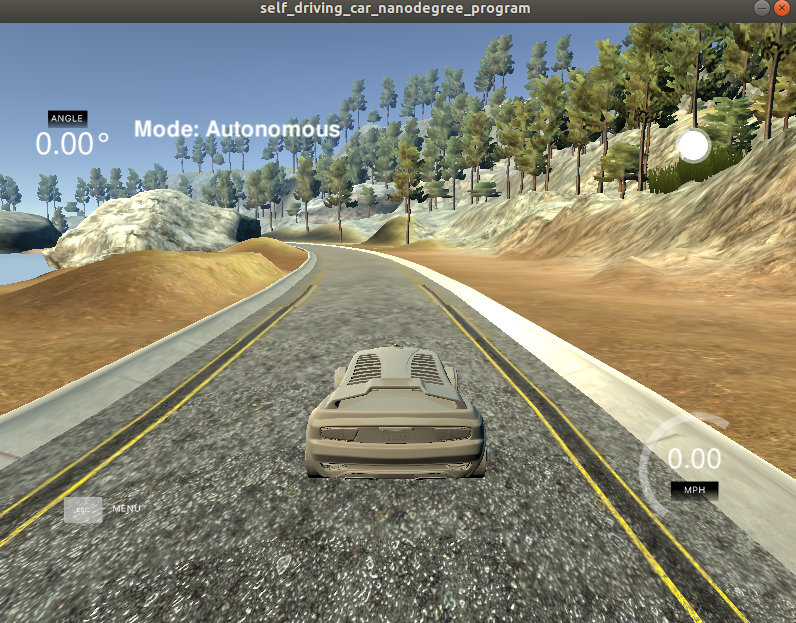

# CarND-Controls-PID
Self-Driving Car Engineer Nanodegree Program

---

## Overview
In the project, I implemented PID Controller using C++ to make vehicle keeping on the center of lane and automatically turn back once it will be out of the center. The Vehicle make a response on steer angle according to cross track error(CTE) value fed by simulator.
The simulator is like following figure:

## Initilization and Effect of P, I, D
For the PID Controller algorithm, the parameters Kp, Ki and Kd are key factors for the performance.

"P" stands for proportional. p controller is inversely proportional to CTE value by turning. Parameter Kp is the strength of the proportional controller. So if the vehicl is only controlled by P Controller, the car will generally overshoot, then oscillate and at the end it will be out of lane. the video is only P controller implementation [.P controller](./videos/P.mp4).

"D" stands for derivative. D controller is inversely proportional to temporal derivative of cte, which means D controller can oberseved the gradient of change rate of cte. when cte goes smaller over time, the D error also goes smaller, which will lead vehicle to gracefully approach our target trajectory. So in my opinion, D controller like a supplementary controller for P controller to prevent vehicle from overshoots and approach the target trajectory smoothly. But if P controller is abandoned and D controller play a solo, the D controller doesn't have adequate ability to steer vichle to the goal. The video is only D controller implementation [.D controller](./videos/D.mp4).

"I" stands for integral. If the vehicle run on normal steering mode(PD control) for a long time and the vehicle can't get closer to  goal, that means the vehicle have a constant bias far away from the goal. In order to overcome the issue, I controller is inversely proportional to integral of all the crosstrack errors. If car is only controlled by I controller in project simulator, the vehile will easily go out of lane. The reason is that in the simulator scenario, cte value is not that large, in other word, vehicle is nearly close to center of lane. Therefore I controller sometimes will overpower for the vihcle. The video is only I controller implementation [.I controller](./videos/I.mp4).

## Final Hyperparameters choosen
The parameters were choosen manually by tries. Cte is relative small, around 0.7 by setting Kp, Ki and Kd to zero, so as I mentioned above, in the scenario, I controller is probably overpowerfull. So I tried set the value to 0.0001 or 0.0, there is not visibly difference between performances under different values. So I set Ki to 0.0. And for P controller, the goal I tried to achieve is that the vihcle can keep it on the lane at beginning straigth lane, Finally 0.15 is choosen for Kp. And for D controller, the parameter value is choosen for handling overshoot on any different scenarios like, curve and straight lanes. And the final parameter I choosen is 2.5. 
The final parameters are:

| Parameter                        |     Value                       |
|:---------------------:|:---------------------------------------------:|
| P                 | 0.15                                 |
| I             | 0.0 |
| D         | 2.5  |

When PID controller algorithm is implemented, the vehicle can successfully drive a lap around the track, like the following video:
[.PID controller](./videos/PID.mp4).
